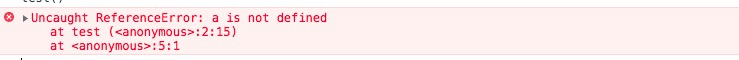
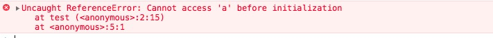
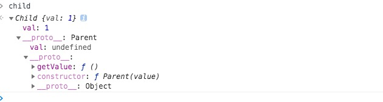

<!-- @import "[TOC]" {cmd="toc" depthFrom=2 depthTo=3 orderedList=false} -->

# ES6 高频知识点

## var、let 及 const 区别

> 什么是提升？什么是暂时性死区？var、let 及 const 区别？

> 对于这个问题，我们应该先来了解提升（hoisting）这个概念。

```js
console.log(a); // undefined
var a = 1;
```

从上述代码中我们可以发现，虽然变量还没有被声明，但是我们却可以使用这个未被声明的变量，这种情况就叫做提升，并且提升的是声明。

对于这种情况，我们可以把代码这样来看

```js
var a;
console.log(a); // undefined
a = 1;
```

接下来我们再来看一个例子

```js
var a = 10;
var a;
console.log(a);
```

对于这个例子，如果你认为打印的值为 <code>undefined</code> 那么就错了，答案应该是 <code>10</code>，对于这种情况，我们这样来看代码

```js
var a;
var a;
a = 10;
console.log(a);
```

到这里为止，我们已经了解了 <code>var</code> 声明的变量会发生提升的情况，其实不仅**变量**会提升**函数**也会被提升。

```js
console.log(a); // ƒ a() {}
function a() {}
var a = 1;
```

对于上述代码，打印结果会是 `ƒ a() {}`，即使变量声明在函数之后，这也说明了函数会被提升，并且优先于变量提升。

说完了这些，想必大家也知道 `var` 存在的问题了，使用 `var` 声明的变量会被提升到作用域的顶部，接下来我们再来看 `let` 和 `const` 。

我们先来看一个例子：

```js
var a = 1;
let b = 1;
const c = 1;
console.log(window.b); // undefined
console.log(window.c); // undefined

function test() {
  console.log(a);
  let a;
}
test();
```

首先在全局作用域下使用 `let` 和 `const` 声明变量，变量并不会被挂载到 `window` 上，这一点就和 `var` 声明有了区别。

再者当我们在声明 `a` 之前如果使用了 `a`，就会出现报错的情况



此处的 test 函数中使用打印 a 会导致如下错误



你可能会认为这里也出现了提升的情况，但是因为某些原因导致不能访问。

首先报错的原因是因为存在暂时性死区，我们不能在声明前就使用变量，这也是 `let` 和 `const` 优于 `var` 的一点。然后这里你认为的提升和 `var` 的提升是有区别的，虽然变量在编译的环节中被告知在这块作用域中可以访问，但是访问是受限制的。

那么到这里，想必大家也都明白 `var`、`let` 及 `const` 区别了，不知道你是否会有这么一个疑问，为什么要存在提升这个事情呢，其实提升存在的根本原因就是为了解决函数间互相调用的情况

```js
function test1() {
  test2();
}
function test2() {
  test1();
}
test1();
```

假如不存在提升这个情况，那么就实现不了上述的代码，因为不可能存在 `test1` 在 `test2` 前面然后 `test2` 又在 `test1` 前面。

那么最后我们总结下这小节的内容：

- 函数提升优先于变量提升，函数提升会把整个函数挪到作用域顶部，变量提升只会把声明挪到作用域顶部
- `var` 存在提升，我们能在声明之前使用。`let`、`const` 因为暂时性死区的原因，不能在声明前使用
- `var` 在全局作用域下声明变量会导致变量挂载在 window 上，其他两者不会
- `let` 和 `const` 作用基本一致，但是后者声明的变量不能再次赋值

## 原型继承和 Class 继承

> 原型如何实现继承？Class 如何实现继承？Class 本质是什么？

首先先来讲下 `class`，其实在 JS 中并不存在类，`class` 只是语法糖，本质还是函数。

```js
class Person {}
Person instanceof Function; // true
```

在上一章节中我们讲解了原型的知识点，在这一小节中我们将会分别使用原型和 `class` 的方式来实现继承。

### 组合继承

组合继承是最常用的继承方式，

```js
function Parent(value) {
  this.val = value;
}
Parent.prototype.getValue = function () {
  console.log(this.val);
};
function Child(value) {
  Parent.call(this, value);
}
Child.prototype = new Parent();

const child = new Child(1);

child.getValue(); // 1
child instanceof Parent; // true
```

以上继承的方式核心是在子类的构造函数中通过 `Parent.call(this)` 继承父类的属性，然后改变子类的原型为 `new Parent()` 来继承父类的函数。

这种继承方式优点在于构造函数可以传参，不会与父类引用属性共享，可以复用父类的函数，但是也存在一个缺点就是在继承父类函数的时候调用了父类构造函数，导致子类的原型上多了不需要的父类属性，存在内存上的浪费。



### 寄生组合继承

这种继承方式对组合继承进行了优化，组合继承缺点在于继承父类函数时调用了构造函数，我们只需要优化掉这点就行了。

```js
function Parent(value) {
  this.val = value;
}

Parent.prototype.getValue = function () {
  console.log(this.val);
};

function Child(value) {
  Parent.call(this, value);
}

Child.prototype = Object.create(Parent.prototype, {
  constructor: {
    value: Child,
    enumerable: false,
    writable: true,
    configurable: true,
  },
});

const child = new Child(1);

child.getValue(); // 1
child instanceof Parent; // true
```
