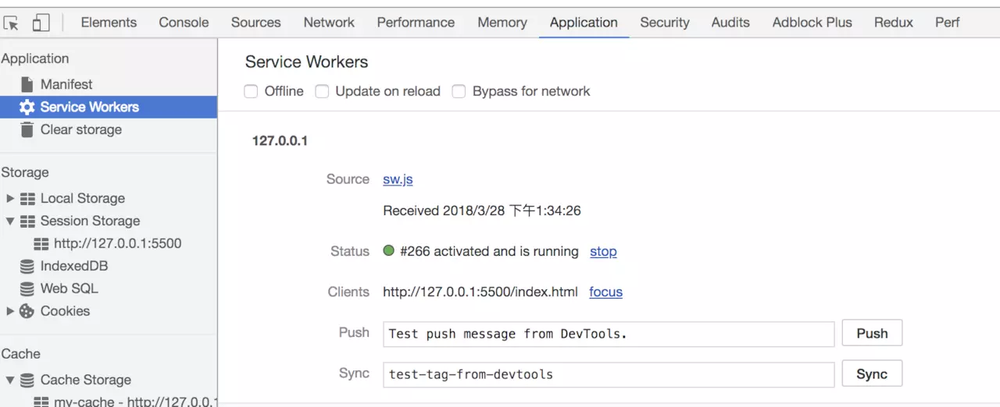
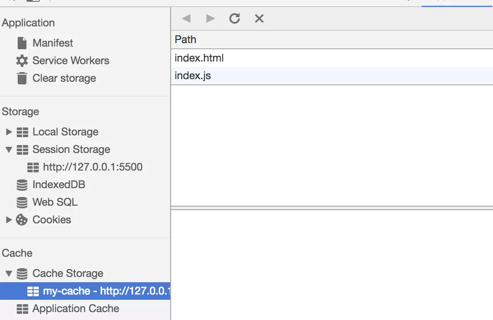

- [浏览器基础知识点](#浏览器基础知识点)
    - [事件触发三阶段](#事件触发三阶段)
    - [注册事件](#注册事件)
    - [事件代理](#事件代理)
  - [跨域](#跨域)
    - [JSONP](#jsonp)
    - [CORS](#cors)
      - [简单请求](#简单请求)
      - [复杂请求](#复杂请求)
    - [document.domain](#documentdomain)
    - [postMessage](#postmessage)
  - [存储](#存储)
    - [cookie，localStorage，sessionStorage，indexDB](#cookielocalstoragesessionstorageindexdb)
    - [Service Worker](#service-worker)

# 浏览器基础知识点

> 事件的触发过程是怎么样的？知道什么是事件代理嘛？

### 事件触发三阶段

事件触发有三个阶段：

- window 往事件触发处传播，遇到注册的捕获事件会触发
- 传播到事件触发处时触发注册的事件
- 从事件触发处往 window 传播，遇到注册的冒泡事件会触发

事件触发一般来说会按照上面的顺序进行，但是也有特例，**如果给一个 `body` 中的子节点同时注册冒泡和捕获事件，事件触发会按照注册的顺序执行**。

```js
// 以下会先打印冒泡然后是捕获
node.addEventListener(
  "click",
  (event) => {
    console.log("冒泡");
  },
  false
);
node.addEventListener(
  "click",
  (event) => {
    console.log("捕获 ");
  },
  true
);
```

### 注册事件

通常我们使用 `addEventListener` 注册事件，该函数的第三个参数可以是布尔值，也可以是对象。对于布尔值 `useCapture` 参数来说，该参数默认值为 `false` ，`useCapture` 决定了注册的事件是捕获事件还是冒泡事件。对于对象参数来说，可以使用以下几个属性

- `capture`：布尔值，和 `useCapture` 作用一样
- `once`：布尔值，值为 `true` 表示该回调只会调用一次，调用后会移除监听
- `passive`：布尔值，表示永远不会调用 `preventDefault`

一般来说，如果我们只希望事件只触发在目标上，这时候可以使用 `stopPropagation` 来阻止事件的进一步传播。通常我们认为 `stopPropagation` 是用来阻止事件冒泡的，其实该函数也可以阻止捕获事件。`stopImmediatePropagation` 同样也能实现阻止事件，但是还能阻止该事件目标执行别的注册事件。

```js
node.addEventListener(
  "click",
  (event) => {
    event.stopImmediatePropagation();
    console.log("冒泡");
  },
  false
);
// 点击 node 只会执行上面的函数，该函数不会执行
node.addEventListener(
  "click",
  (event) => {
    console.log("捕获 ");
  },
  true
);
```

### 事件代理

如果一个节点中的子节点是动态生成的，那么子节点需要注册事件的话应该注册在父节点上

```html
<ul id="ul">
  <li>1</li>
  <li>2</li>
  <li>3</li>
  <li>4</li>
  <li>5</li>
</ul>
<script>
  let ul = document.querySelector("#ul");
  ul.addEventListener("click", (event) => {
    console.log(event.target);
  });
</script>
```

事件代理的方式相较于直接给目标注册事件来说，有以下优点：

- 节省内存
- 不需要给子节点注销事件

## 跨域

> 什么是跨域？为什么浏览器要使用同源策略？你有几种方式可以解决跨域问题？了解预检请求嘛？

因为浏览器出于安全考虑，有同源策略。也就是说，如果协议、域名或者端口有一个不同就是跨域，Ajax 请求会失败。

**那么是出于什么安全考虑才会引入这种机制呢？** 其实主要是用来防止 CSRF 攻击的。简单点说，CSRF 攻击是利用用户的登录态发起恶意请求。

也就是说，没有同源策略的情况下，A 网站可以被任意其他来源的 Ajax 访问到内容。如果你当前 A 网站还存在登录态，那么对方就可以通过 Ajax 获得你的任何信息。当然跨域并不能完全阻止 CSRF。

**然后我们来考虑一个问题，请求跨域了，那么请求到底发出去没有？** 请求必然是发出去了，但是浏览器拦截了响应。你可能会疑问明明通过表单的方式可以发起跨域请求，为什么 Ajax 就不会。因为归根结底，跨域是为了阻止用户读取到另一个域名下的内容，Ajax 可以获取响应，浏览器认为这不安全，所以拦截了响应。但是表单并不会获取新的内容，所以可以发起跨域请求。同时也说明了跨域并不能完全阻止 CSRF，因为请求毕竟是发出去了。

接下来我们将来学习几种常见的方式来解决跨域的问题。

### JSONP

JSONP 的原理很简单，就是利用 `<script>` 标签没有跨域限制的漏洞。通过 `<script>` 标签指向一个需要访问的地址并提供一个回调函数来接收数据当需要通讯时。

```js
<script src="http://domain/api?param1=a&param2=b&callback=jsonp"></script>
<script>
    function jsonp(data) {
    	console.log(data)
	}
</script>
```

JSONP 使用简单且兼容性不错，但是只限于 `get` 请求。

在开发中可能会遇到多个 JSONP 请求的回调函数名是相同的，这时候就需要自己封装一个 JSONP，以下是简单实现

```js
function jsonp(url, jsonpCallback, success) {
  let script = document.createElement("script");
  script.src = url;
  script.async = true;
  script.type = "text/javascript";
  window[jsonpCallback] = function (data) {
    success && success(data);
  };
  document.body.appendChild(script);
}
jsonp("http://xxx", "callback", function (value) {
  console.log(value);
});
```

### CORS

CORS 需要浏览器和后端同时支持。IE 8 和 9 需要通过 `XDomainRequest` 来实现。

浏览器会自动进行 CORS 通信，实现 CORS 通信的关键是后端。只要后端实现了 CORS，就实现了跨域。

服务端设置 `Access-Control-Allow-Origin` 就可以开启 CORS。 该属性表示哪些域名可以访问资源，如果设置通配符则表示所有网站都可以访问资源。

虽然设置 CORS 和前端没什么关系，但是通过这种方式解决跨域问题的话，会在发送请求时出现两种情况，分别为简单请求和复杂请求。

#### 简单请求

以 `Ajax` 为例，当满足以下条件时，会触发简单请求

1. 使用下列方法之一：

   - GET
   - HEAD
   - POST

2. `Content-Type` 的值仅限于下列三者之一：

   - text/plain
   - multipart/form-data
   - application/x-www-form-urlencoded

请求中的任意 `XMLHttpRequestUpload` 对象均没有注册任何事件监听器； `XMLHttpRequestUpload` 对象可以使用 `XMLHttpRequest.upload` 属性访问。

#### 复杂请求

那么很显然，不符合以上条件的请求就肯定是复杂请求了。

对于复杂请求来说，首先会发起一个预检请求，该请求是 option 方法的，通过该请求来知道服务端是否允许跨域请求。

对于预检请求来说，如果你使用过 Node 来设置 CORS 的话，可能会遇到过这么一个坑。

以下以 express 框架举例：

```js
app.use((req, res, next) => {
  res.header("Access-Control-Allow-Origin", "*");
  res.header("Access-Control-Allow-Methods", "PUT, GET, POST, DELETE, OPTIONS");
  res.header(
    "Access-Control-Allow-Headers",
    "Origin, X-Requested-With, Content-Type, Accept, Authorization, Access-Control-Allow-Credentials"
  );
  next();
});
```

该请求会验证你的 `Authorization` 字段，没有的话就会报错。

当前端发起了复杂请求后，你会发现就算你代码是正确的，返回结果也永远是报错的。因为预检请求也会进入回调中，也会触发 next 方法，因为预检请求并不包含 `Authorization` 字段，所以服务端会报错。

想解决这个问题很简单，只需要在回调中过滤 `option` 方法即可

```js
res.statusCode = 204;
res.setHeader("Content-Length", "0");
res.end();
```

### document.domain

该方式只能用于二级域名相同的情况下，比如 `a.test.com` 和 `b.test.com` 适用于该方式。

只需要给页面添加 `document.domain = 'test.com'` 表示二级域名都相同就可以实现跨域

### postMessage

这种方式通常用于获取嵌入页面中的第三方页面数据。一个页面发送消息，另一个页面判断来源并接收消息

```js
// 发送消息端
window.parent.postMessage("message", "http://test.com");
// 接收消息端
var mc = new MessageChannel();
mc.addEventListener("message", (event) => {
  var origin = event.origin || event.originalEvent.origin;
  if (origin === "http://test.com") {
    console.log("验证通过");
  }
});
```

## 存储

> 有几种方式可以实现存储功能，分别有什么优缺点？什么是 Service Worker？

### cookie，localStorage，sessionStorage，indexDB

我们先来通过表格学习下这几种存储方式的区别
|特性 |cookie |localStorage| sessionStorage| indexDB|
| :----------: | :-: | :-: | :-: | :-: |
| 数据生命周期 | 一般由服务器生成，可以设置过期时间 | 除非被清理，否则一直存在 | 页面关闭就清理 | 除非被清理，否则一直存在 |
| 数据存储大小 | 4k | 5M | 5M | 无限 |
| 与服务端通信 | 每次都会携带在 header 中，对于请求性能影响 | 不参与 | 不参与 | 不参与 |

从上表可以看到，`cookie` 已经不建议用于存储。如果没有大量数据存储需求的话，可以使用 `localStorage` 和 `sessionStorage` 。对于不怎么改变的数据尽量使用 localStorage 存储，否则可以用 `sessionStorage` 存储。

对于 `cookie` 来说，我们还需要注意安全性。

|   属性    |                              作用                              |
| :-------: | :------------------------------------------------------------: |
|   value   | 如果用于保存用户登录态，应该将该值加密，不能使用明文的用户标识 |
| http-only |             不能通过 JS 访问 Cookie，减少 XSS 攻击             |
|  secure   |                只能在协议为 HTTPS 的请求中携带                 |
| same-site |     规定浏览器不能在跨域请求中携带 Cookie，减少 CSRF 攻击      |

### Service Worker

Service Worker 是运行在浏览器背后的独立线程，一般可以用来实现缓存功能。使用 Service Worker 的话，传输协议必须为 HTTPS。因为 Service Worker 中涉及到请求拦截，所以必须使用 HTTPS 协议来保障安全。

Service Worker 实现缓存功能一般分为三个步骤：首先需要先注册 Service Worker，然后监听到 `install` 事件以后就可以缓存需要的文件，那么在下次用户访问的时候就可以通过拦截请求的方式查询是否存在缓存，存在缓存的话就可以直接读取缓存文件，否则就去请求数据。以下是这个步骤的实现：

```js
// index.js
if (navigator.serviceWorker) {
  navigator.serviceWorker
    .register("sw.js")
    .then(function (registration) {
      console.log("service worker 注册成功");
    })
    .catch(function (err) {
      console.log("servcie worker 注册失败");
    });
}
// sw.js
// 监听 `install` 事件，回调中缓存所需文件
self.addEventListener("install", (e) => {
  e.waitUntil(
    caches.open("my-cache").then(function (cache) {
      return cache.addAll(["./index.html", "./index.js"]);
    })
  );
});

// 拦截所有请求事件
// 如果缓存中已经有请求的数据就直接用缓存，否则去请求数据
self.addEventListener("fetch", (e) => {
  e.respondWith(
    caches.match(e.request).then(function (response) {
      if (response) {
        return response;
      }
      console.log("fetch source");
    })
  );
});
```

打开页面，可以在开发者工具中的 `Application` 看到 Service Worker 已经启动了



在 Cache 中也可以发现我们所需的文件已被缓存



当我们重新刷新页面可以发现我们缓存的数据是从 Service Worker 中读取的


