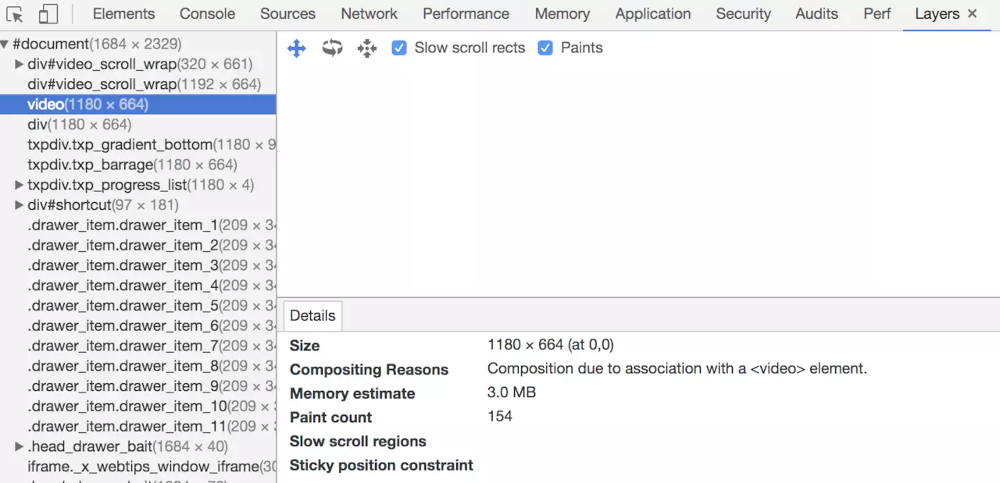

# 浏览器渲染原理

在这一章节中，我们将来学习浏览器渲染原理这部分的知识。你可能会有疑问，我又不是做浏览器研发的，为什么要来学习这个？其实我们学习浏览器渲染原理更多的是为了解决性能的问题，如果你不了解这部分的知识，你就不知道什么情况下会对性能造成损伤。并且渲染原理在面试中答得好，也是一个能与其他候选人拉开差距的一点。

我们知道执行 JS 有一个 JS 引擎，那么执行渲染也有一个渲染引擎。同样，渲染引擎在不同的浏览器中也不是都相同的。比如在 Firefox 中叫做 Gecko，在 Chrome 和 Safari 中都是基于 WebKit 开发的。在这一章节中，我们也会主要学习关于 WebKit 的这部分渲染引擎内容。

## 浏览器接收到 HTML 文件并转换为 DOM 树

当我们打开一个网页时，浏览器都会去请求对应的 HTML 文件。虽然平时我们写代码时都会分为 JS、CSS、HTML 文件，也就是字符串，但是计算机硬件是不理解这些字符串的，所以在网络中传输的内容其实都是 `0` 和 `1` 这些字节数据。当浏览器接收到这些字节数据以后，它会将这些字节数据转换为字符串，也就是我们写的代码。


当数据转换为字符串以后，浏览器会先将这些字符串通过词法分析转换为标记（token），这一过程在词法分析中叫做标记化（tokenization）。


那么什么是标记呢？这其实属于编译原理这一块的内容了。简单来说，标记还是字符串，是构成代码的最小单位。这一过程会将代码分拆成一块块，并给这些内容打上标记，便于理解这些最小单位的代码是什么意思。


当结束标记化后，这些标记会紧接着转换为 Node，最后这些 Node 会根据不同 Node 之前的联系构建为一颗 DOM 树。


以上就是浏览器从网络中接收到 HTML 文件然后一系列的转换过程。


当然，在解析 HTML 文件的时候，浏览器还会遇到 CSS 和 JS 文件，这时候浏览器也会去下载并解析这些文件，接下来就让我们先来学习浏览器如何解析 CSS 文件。

## 将 CSS 文件转换为 CSSOM 树

其实转换 CSS 到 CSSOM 树的过程和上一小节的过程是极其类似的


在这一过程中，浏览器会确定下每一个节点的样式到底是什么，并且这一过程其实是很消耗资源的。因为样式你可以自行设置给某个节点，也可以通过继承获得。在这一过程中，浏览器得递归 CSSOM 树，然后确定具体的元素到底是什么样式。

如果你有点不理解为什么会消耗资源的话，我这里举个例子

```js
<div>
  <a> <span></span> </a>
</div>
<style>
  span {
    color: red;
  }
  div > a > span {
    color: red;
  }
</style>
```

对于第一种设置样式的方式来说，浏览器只需要找到页面中所有的 `span` 标签然后设置颜色，但是对于第二种设置样式的方式来说，浏览器首先需要找到所有的 `span` 标签，然后找到 `span` 标签上的 `a` 标签，最后再去找到 `div` 标签，然后给符合这种条件的 `span` 标签设置颜色，这样的递归过程就很复杂。所以我们应该尽可能的避免写过于具体的 CSS 选择器，然后对于 HTML 来说也尽量少的添加无意义标签，保证层级扁平。

## 生成渲染树

当我们生成 DOM 树和 CSSOM 树以后，就需要将这两棵树组合为渲染树。


在这一过程中，不是简单的将两者合并就行了。渲染树只会包括需要显示的节点和这些节点的样式信息，如果某个节点是 `display: none` 的，那么就不会在渲染树中显示。

当浏览器生成渲染树以后，就会根据渲染树来进行布局（也可以叫做回流），然后调用 GPU 绘制，合成图层，显示在屏幕上。对于这一部分的内容因为过于底层，还涉及到了硬件相关的知识，这里就不再继续展开内容了。

那么通过以上内容，我们已经详细了解到了浏览器从接收文件到将内容渲染在屏幕上的这一过程。接下来，我们将会来学习上半部分遗留下来的一些知识点。

## 为什么操作 DOM 慢

想必大家都听过操作 DOM 性能很差，但是这其中的原因是什么呢？

因为 DOM 是属于渲染引擎中的东西，而 JS 又是 JS 引擎中的东西。当我们通过 JS 操作 DOM 的时候，其实这个操作涉及到了两个线程之间的通信，那么势必会带来一些性能上的损耗。操作 DOM 次数一多，也就等同于一直在进行线程之间的通信，并且操作 DOM 可能还会带来重绘回流的情况，所以也就导致了性能上的问题。

> 插入几万个 DOM，如何实现页面不卡顿？

对于这道题目来说，首先我们肯定不能一次性把几万个 DOM 全部插入，这样肯定会造成卡顿，所以解决问题的重点应该是如何分批次部分渲染 DOM。大部分人应该可以想到通过 `requestAnimationFrame` 的方式去循环的插入 DOM，其实还有种方式去解决这个问题：**虚拟滚动**（virtualized scroller）。

**这种技术的原理就是只渲染可视区域内的内容，非可见区域的那就完全不渲染了，当用户在滚动的时候就实时去替换渲染的内容。**


从上图中我们可以发现，即使列表很长，但是渲染的 DOM 元素永远只有那么几个，当我们滚动页面的时候就会实时去更新 DOM，这个技术就能顺利解决这道经典面试题。如果你想了解更多的内容可以了解下这个 [react-virtualized](https://github.com/bvaughn/react-virtualized)。

## 什么情况阻塞渲染

首先渲染的前提是生成渲染树，所以 HTML 和 CSS 肯定会阻塞渲染。如果你想渲染的越快，你越应该降低一开始需要渲染的文件大小，并且扁平层级，优化选择器。

然后当浏览器在解析到 `script` 标签时，会暂停构建 DOM，完成后才会从暂停的地方重新开始。也就是说，如果你想首屏渲染的越快，就越不应该在首屏就加载 JS 文件，这也是都建议将 `script` 标签放在 body 标签底部的原因。

当然在当下，并不是说 `script` 标签必须放在底部，因为你可以给 `script` 标签添加 `defer` 或者 `async` 属性。

当 `script` 标签加上 `defer` 属性以后，表示该 JS 文件会并行下载，但是会放到 HTML 解析完成后顺序执行，所以对于这种情况你可以把 `script` 标签放在任意位置。

对于没有任何依赖的 JS 文件可以加上 async 属性，表示 JS 文件下载和解析不会阻塞渲染。

## 重绘（Repaint）和回流（Reflow）

重绘和回流会在我们设置节点样式时频繁出现，同时也会很大程度上影响性能。

- 重绘是当节点需要更改外观而不会影响布局的，比如改变 `color` 就叫称为重绘
- 回流是布局或者几何属性需要改变就称为回流。

回流必定会发生重绘，重绘不一定会引发回流。回流所需的成本比重绘高的多，改变父节点里的子节点很可能会导致父节点的一系列回流。

以下几个动作可能会导致性能问题：

- 改变 window 大小
- 改变字体
- 添加或删除样式
- 文字改变
- 定位或者浮动
- 盒模型

并且很多人不知道的是，重绘和回流其实也和 Eventloop 有关。

1. 当 Eventloop 执行完 Microtasks 后，会判断 `document` 是否需要更新，因为浏览器是 60Hz 的刷新率，每 16.6ms 才会更新一次。
2. 然后判断是否有 `resize` 或者 `scroll` 事件，有的话会去触发事件，所以 `resize` 和 `scroll` 事件也是至少 16ms 才会触发一次，并且自带节流功能。
3. 判断是否触发了 media query
4. 更新动画并且发送事件
5. 判断是否有全屏操作事件
6. 执行 `requestAnimationFrame` 回调
7. 执行 `IntersectionObserver` 回调，该方法用于判断元素是否可见，可以用于懒加载上，但是兼容性不好
8. 更新界面
9. 以上就是一帧中可能会做的事情。如果在一帧中有空闲时间，就会去执行 `requestIdleCallback` 回调。

既然我们已经知道了重绘和回流会影响性能，那么接下来我们将会来学习如何减少重绘和回流的次数。

### 减少重绘和回流

- 使用 `transform` 替代 `top`

```js
<div class="test"></div>
<style>
  .test {
    position: absolute;
    top: 10px;
    width: 100px;
    height: 100px;
    background: red;
  }
</style>
<script>
  setTimeout(() => {
    // 引起回流
    document.querySelector('.test').style.top = '100px'
  }, 1000)
</script>
```

- 使用 `visibility` 替换 `display: none` ，因为前者只会引起重绘，后者会引发回流（改变了布局）

- 不要把节点的属性值放在一个循环里当成循环里的变量

```js
for (let i = 0; i < 1000; i++) {
  // 获取 offsetTop 会导致回流，因为需要去获取正确的值
  console.log(document.querySelector(".test").style.offsetTop);
}
```

- 不要使用 `table` 布局，可能很小的一个小改动会造成整个 `table` 的重新布局

- 动画实现的速度的选择，动画速度越快，回流次数越多，也可以选择使用 `requestAnimationFrame`

- CSS 选择符从右往左匹配查找，避免节点层级过多

- 将频繁重绘或者回流的节点设置为图层，图层能够阻止该节点的渲染行为影响别的节点。比如对于 `video` 标签来说，浏览器会自动将该节点变为图层。



设置节点为图层的方式有很多，我们可以通过以下几个常用属性可以生成新图层

- will-change
- video、iframe 标签
